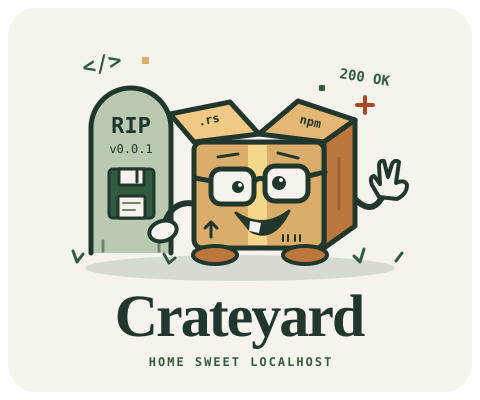

# Crateyard

<!--<p align="center">
  
</p>-->


<p align="center">
  <a href="https://github.com/skorotkiewicz/registry/actions/workflows/build.yml"></a>
  <a href="https://github.com/skorotkiewicz/registry/releases/latest"></a>
  <a href="https://aur.archlinux.org/packages/crateyard-bin"></a>
  <a href="https://go.dev/"></a>
  <a href="https://github.com/skorotkiewicz/registry/blob/main/LICENSE"></a>
</p>

Crateyard is a small self-hosted registry for Rust crates and npm packages, with a web browser for your packages. Use normal `cargo publish`, `npm publish`, and dependency installs. Written in Go with one TOML parsing dependency. Package metadata and archives live on disk.

Each configured user has a nickname and their own token. By default the registry is private, so reading packages requires a token too. Set `private = false` for anonymous browsing and downloads. Publishing and yanking always require a user token. All users have the same permissions, with no per-package ownership rules, so only give tokens to trusted publishers.

## Project layout

```text
cmd/crateyard/       Go application and its *_test.go unit tests
cmd/crateyard/web/   HTML, CSS, and JavaScript embedded in the binary
tests/smoke.sh      Cargo/npm integration test
config.toml        Server configuration template
```

Module files, configuration, and deployment files stay at the repository root. Run the following build commands from there.

## Run

Requires Go 1.23 or newer to build. The compiled server needs no Go installation.

```sh
cp config.toml config.local.toml
chmod 600 config.local.toml
openssl rand -hex 32
```

Put the generated token in your user's `token` field in `config.local.toml`, then start the server:

```sh
go build -ldflags="-X main.version=$(cat VERSION)" -o crateyard ./cmd/crateyard
./crateyard -config config.local.toml
```

`VERSION` contains the application version. Builds made with `just build`, Docker, or the release workflow include it in the binary. Check it with `crateyard --version`; the version command does not need a config file.

Without `-config`, the server reads `config.toml` from the working directory. The supplied file lists every setting and has an empty token so it cannot accidentally start with a shared example secret. `config.local.toml` is gitignored. Keep configured tokens out of Git.

## Configuration

All server settings come from the TOML file. Previous server environment variables no longer override them. Omitted settings use the defaults below, but at least one valid user is required. Restart the server after editing the file.

| Setting | Default | Purpose |
| --- | --- | --- |
| `listen_addr` | `127.0.0.1:8080` | HTTP bind address |
| `public_url` | `http://localhost:8080` | Client-visible origin, without a path |
| `data_dir` | `data` | Persistent storage, relative to the working directory |
| `private` | `true` | Require tokens for package reads |
| `max_upload_mib` | `64` | Request body limit, between 1 and 1024 MiB |
| `max_header_bytes` | `16384` | HTTP header limit, between 1 and 1048576 bytes |
| `read_header_timeout` | `"10s"` | Time allowed to read request headers |
| `read_timeout` | `"2m"` | Time allowed to read an entire request |
| `write_timeout` | `"2m"` | Time allowed to write a response |
| `idle_timeout` | `"1m"` | Keep-alive idle timeout |

Timeouts must be positive durations. Unknown settings, invalid values, empty tokens, and duplicate nicknames or tokens prevent startup.

Add users with separate tokens:

```toml
[[users]]
nick = "alice"
token = "REPLACE_WITH_ALICES_GENERATED_TOKEN"

[[users]]
nick = "bob"
token = "REPLACE_WITH_BOBS_GENERATED_TOKEN"
```

Generate each token separately with `openssl rand -hex 32`. Tokens must contain at least 16 printable ASCII characters and no whitespace. Use your own token in Cargo, npm, and the web interface. `npm whoami --registry http://localhost:8080/npm/` returns your configured nickname.

`private = true` requires authentication for the catalog, metadata, index entries, and archives. `private = false` allows anonymous GET/HEAD package reads and opens the web catalog without login. Neither mode allows anonymous publishing or yanking. The web page, static assets, health checks, and Cargo's registry configuration are always public. Remove a user or replace their token and restart to revoke it.

For another machine, set `public_url` to its actual URL. For example, `https://packages.example.com`. Put the server behind an HTTPS reverse proxy before using it outside localhost. Forward all paths to the server so the web interface and both registries work. The proxy must allow 64 MiB request bodies and preserve the `Authorization` header. The server does not trust forwarded headers to construct download URLs.

### Docker

In `config.local.toml`, set `listen_addr = "0.0.0.0:8080"` and `data_dir = "/data"`. Set `public_url` to the address your clients use. The config is mounted separately and is not included in the image.

```sh
docker build -t crateyard .
chgrp "$(id -g)" config.local.toml
chmod 640 config.local.toml
docker run -d --name crateyard \
  -p 127.0.0.1:8080:8080 \
  --group-add "$(id -g)" \
  -v "$PWD/config.local.toml:/config.toml:ro" \
  -v crateyard-data:/data \
  --restart unless-stopped \
  crateyard
```

The supplementary group lets the container read the config without making it world-readable. A named volume keeps packages across container restarts. If you use a bind mount for data instead, its directory must be writable by the container. Keep `public_url` consistent with the address used by clients, including its scheme and port.

## Web interface

Open `http://localhost:8080`. Private registries ask for your user token; public registries open the package list automatically. You can:

- Browse a dark, cgit-style package index and filter by name, publisher, or package type.
- See who first published each package. npm names come from the publisher directory; new Cargo crates record the authenticated nickname. Older Cargo records show `unknown`.
- View published versions, npm tags, and yanked crate versions.
- Copy install commands and view client configuration snippets.

Click Refresh after publishing. Disconnect clears the package list and token. The token stays only in the page's memory, not in cookies, URLs, or browser storage. Reloading the page also clears it.

The interface is read-only. Publish from Cargo or npm using the instructions below. It is embedded in the server binary, so you do not need a separate frontend server or build step.

## Cargo

Requires Cargo 1.74 or newer for this authenticated sparse-index setup.

Add this to `~/.cargo/config.toml` or your project's `.cargo/config.toml`:

```toml
[registries.selfhost]
index = "sparse+http://localhost:8080/cargo/"
credential-provider = "cargo:token"
```

Set `REGISTRY_TOKEN` in your client shell to your own token from `[[users]]`, then:

```sh
export CARGO_REGISTRIES_SELFHOST_TOKEN="$REGISTRY_TOKEN"
cargo publish --registry selfhost
```

Alternatively, `cargo login --registry selfhost` stores your token in Cargo's credentials file. Public registries do not require a token to install dependencies, but publishing and yanking still do.

In the crate being published, restrict publication to this registry:

```toml
[package]
name = "my-library"
version = "0.1.0"
publish = ["selfhost"]
```

In a consuming project's `Cargo.toml`:

```toml
[dependencies]
my-library = { version = "0.1.0", registry = "selfhost" }
```

```sh
cargo build
cargo yank my-library --version 0.1.0 --registry selfhost
cargo yank my-library --version 0.1.0 --undo --registry selfhost
```

The registry supports renamed dependencies, optional dependencies, extended feature syntax, and dependencies from other registries. Crate names must start with a lowercase letter and contain only lowercase letters, digits, hyphens, or underscores, up to 64 characters. Names differing only by hyphens and underscores cannot coexist.

## npm

Use a scope so normal public npm packages still come from npmjs.org. Add to your project's `.npmrc`:

```ini
@selfhost:registry=http://localhost:8080/npm/
//localhost:8080/npm/:_authToken=${REGISTRY_TOKEN}
```

Export your own user token as `REGISTRY_TOKEN` in the client shell. Do not commit it to `.npmrc`. For read-only use of a public registry, omit the `_authToken` line.

For a package with `"name": "@selfhost/my-package"` in `package.json`:

```sh
npm publish --registry http://localhost:8080/npm/
npm install @selfhost/my-package --no-audit
```

Publishing with `--tag beta` preserves `latest` and adds a `beta` tag. Regular and scoped names both work. For an unscoped package, use `--registry http://localhost:8080/npm/` on both publish and install, and configure authentication for that URL.

Replace both URLs in `.npmrc` when using another host. For HTTPS, the auth key still omits the scheme, for example `//packages.example.com/npm/:_authToken=${REGISTRY_TOKEN}`.

## Storage and limits

npm packages are stored in `data/npm/<userName>/<packageName>/`, using the first publisher's configured `nick`. Metadata and all version archives stay in that directory, even when another user publishes an update. Special characters in directory names are URL-escaped, so `@scope/example` becomes `@scope%2Fexample` on disk. The configured `data_dir` replaces `data` in these paths.

npm package names remain global and client URLs do not change. This folder grouping does not add ownership restrictions. Removing a user does not remove their packages. Cargo storage is unchanged.

- Published versions cannot be overwritten. Cargo yank changes availability without deleting the archive.
- Uploads commit the archive first and then atomically replace metadata. An interrupted publish can leave an unused archive or temporary file, but not a partial committed archive.
- Run exactly one server process per data directory. Requests share one lock. This is intended for small team registries, not high-throughput hosting.
- The default request limit is 64 MiB, configurable with `max_upload_mib`. npm's base64 encoding means its default tarball limit is about 48 MiB, less metadata overhead. Uploads and package metadata are buffered in memory.
- Stop the server before backing up the entire data directory for a consistent backup. Restore it with the same file permissions. User tokens live in the config file, not in the data directory. Back up the config separately and protect its permissions.
- No upstream proxy, public package mirror, user registration, ownership API, Cargo/npm search endpoints, npm login, npm audit, npm unpublish, standalone dist-tag editing, or provenance bundles. Configure tokens directly and use `--no-audit` for npm installs. Archives are stored without extracting or inspecting their manifests. Only publish packages you trust.

## Tests

```sh
go test -race ./...
go vet ./...
bash tests/smoke.sh
SMOKE_PRIVATE=false bash tests/smoke.sh
```

The smoke test requires Go, Cargo, npm, Node, curl, and Bash. It starts a localhost server, publishes and consumes real packages, checks per-user identity, npm publisher directories, duplicate rejection, and Cargo yank/undo, then restarts the server to check persistence and the web package catalog. The public-mode run also installs packages without tokens and checks that anonymous writes remain blocked. Test files stay in the printed temporary directory. Set `SMOKE_PORT` if port 18080 is occupied.
